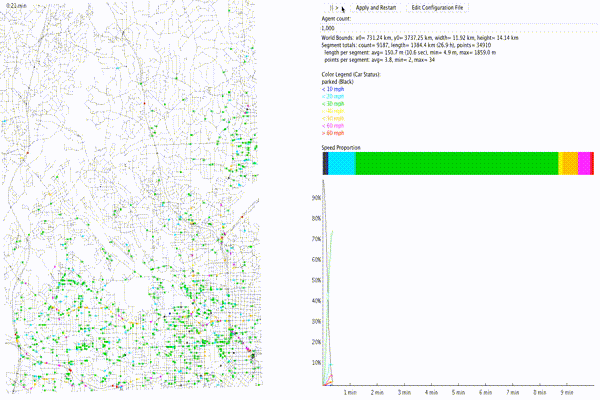

# GTMobisim

Simulator for generating mobility traces and query traces for large numbers of mobile agents moving in a road network

### Screenshots

### Prerequisites
* [Java 8](http://www.oracle.com/technetwork/java/javase/downloads/jdk8-downloads-2133151.html)
* [IntelliJ](https://www.jetbrains.com/idea/) - or - [Eclipse](http://www.eclipse.org/downloads/eclipse-packages/)

## Initial Work

* [gt-mobisim](https://code.google.com/archive/p/gt-mobisim/)

## Acknowledgments
* [Ling Liu](https://www.cc.gatech.edu/~lingliu)
