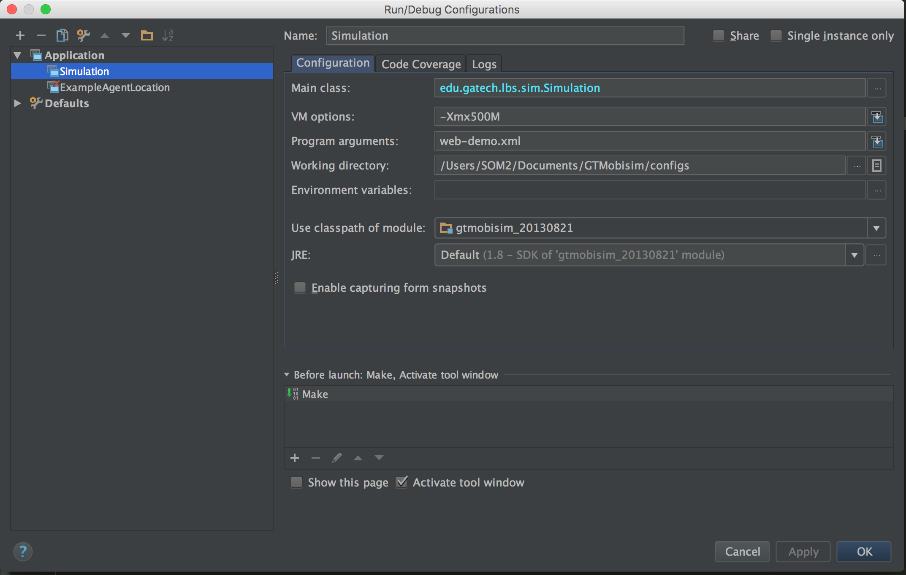

# GTMobisim


Simulator for generating mobility traces and query traces for large numbers of mobile agents moving in a road network

### Screenshots

### Prerequisites
* [Java 8](http://www.oracle.com/technetwork/java/javase/downloads/jdk8-downloads-2133151.html)
* [IntelliJ](https://www.jetbrains.com/idea/) - or - [Eclipse](http://www.eclipse.org/downloads/eclipse-packages/)

## Initial Work

* [gt-mobisim](https://code.google.com/archive/p/gt-mobisim/)

### Documentation
* [gt-mobisim-visualization-sm](https://docs.google.com/presentation/d/1DR9LVk_yvhNLQrlwvTPKg2P7smQg0t6qZj74NQhZiSw/edit?usp=sharing)
### Run configuration using IntelliJ
1. In run tab, select edit configuration
2. Example Run configuration 


### Example for adding statistics

GTMobism-Visualization-SM has added utility class for aggregating metrics and statistics throughout the simulation or when building the trace/query files.
MetricsManager class is meant to be used as a static file which will maintain the state throughout the lifecycle of the simulation.
Following is an example workflow of outputting new statistics at the end of the simulation. For the purpose of the example, we will output the average speed of agents on every road segments.

First off, we need to add a variable for storing the state of the application.
We'll call these roadSegmentAverageSpeed and roadSegmentTotalAgentCount.

```
...
private static Map<Integer, AtomicLong> roadSegmentAverageSpeed;
private static Map<Integer, AtomicInteger> roadSegmentTotalAgentCount;
...
```

Notice that we're using AtomicLong and AtomicInteger. While it may not be same for all cases, some of the statistics has to be aggregated from multiple threads. 
For thread safety, we're opting to use Atomic variables and synchronized methods as follows.

```
...
public synchronized static void updateAverageSpeedForRoadSegment(int roadSegmentId, double mph) {
    if (roadSegmentAverageSpeed == null) {
        roadSegmentAverageSpeed = new ConcurrentHashMap<>();
        roadSegmentTotalAgentCount = new ConcurrentHashMap<>();
    }

    if (roadSegmentAverageSpeed.containsKey(roadSegmentId)) {
        long avgMphLongBits = roadSegmentAverageSpeed.get(roadSegmentId).getAndUpdate((longBits) -> {
            roadSegmentTotalAgentCount.get(roadSegmentId).getAndIncrement();

            double newAvg = (mph + Double.longBitsToDouble(longBits))/(double)roadSegmentTotalAgentCount.get(roadSegmentId).get();

            return Double.doubleToLongBits(newAvg);
        });
    } else {
        roadSegmentAverageSpeed.put(roadSegmentId, new AtomicLong(Double.doubleToLongBits(mph)));
        roadSegmentTotalAgentCount.put(roadSegmentId, new AtomicInteger(1));
    }
}

public static Map<Integer, AtomicLong> getRoadSegmentAverageSpeed() {
    return roadSegmentAverageSpeed;
}
```

Notice that it's been made very convenient for the user to output statistics. The user does not have to know the inner workings of metrics aggregating process but simply has to know the road segment id and the new speed. It is advised to keep it this way in order to simplify the code and separate application logic from metrics gather logic.

Now that we've put in the pieces to aggregate desired statistics, we have to find where to get such data.
In most cases, try looking in *Event classes to capture events being generated or the Simulation class itself where every event is being processed.
One might also be able to capture data as it is being drawn on the GUI (e.g. AgentsDrawer)

For the purpose of this excercise, Simulation class has "updateAgentIndex" method which captures what agents are on which road segment.
Since this method knows both the road segment id and the speed of the agent on the segment, we will output the statistics here as follows:

```
if (oldSegmentId >= 0) {
    agentIndex.get(oldSegmentId).remove(agent);
    MetricsManager.updateAverageSpeedForRoadSegment(oldSegmentId, agent.getMph());
}
```
As you can see, with the added static method, metrics aggregation can be done in one line and maintains the readability of the code.

Now that we're gathering metrics, we need a way to output/show this to the user at the end of the Simulation.

This can either be done by writing to an output file or visually presenting it to the user.
For this excercise, we will show the statistics in csv format for the user.

In Simulation class, we have a method for formatting and outputting statistics which gets called at the end of the simulation called "getStatistics"

For the sake of readability, we're opting to keep all the file and GUI generation for statics in this method.
See the following code snippet for showing the statics as a csv file format on a window

```
Map<Integer, AtomicLong> roadSegmentAverageSpeed = MetricsManager.getRoadSegmentAverageSpeed();
it = roadSegmentAverageSpeed.entrySet().iterator();

final JFrame speedWindow = new JFrame();
final JTextArea speedText = new JTextArea(40,20);
JScrollPane scroll = new JScrollPane(speedText);

StringBuilder speedBuilder = new StringBuilder();
speedBuilder.append("road segment id, average mph\n");
while (it.hasNext()) {
  Map.Entry<Integer, AtomicLong> pair = (Map.Entry)it.next();

  speedBuilder.append(pair.getKey());
  speedBuilder.append(", ");
  speedBuilder.append(Double.longBitsToDouble(pair.getValue().get()));
  speedBuilder.append("\n");
  System.out.println("roadSegmentId: " + pair.getKey() + ", avg mph: " + Double.longBitsToDouble(pair.getValue().get()));
}

speedText.setText(speedBuilder.toString());
JPanel configPanel = new JPanel();
configPanel.setLayout(new BoxLayout(configPanel, BoxLayout.Y_AXIS));
configPanel.add(scroll);

speedWindow.add(scroll);
speedWindow.pack();
speedWindow.setVisible(true);
```

User can choose to take the csv file for further analysis after each simulation.

## Acknowledgments
* [Ling Liu](https://www.cc.gatech.edu/~lingliu)
